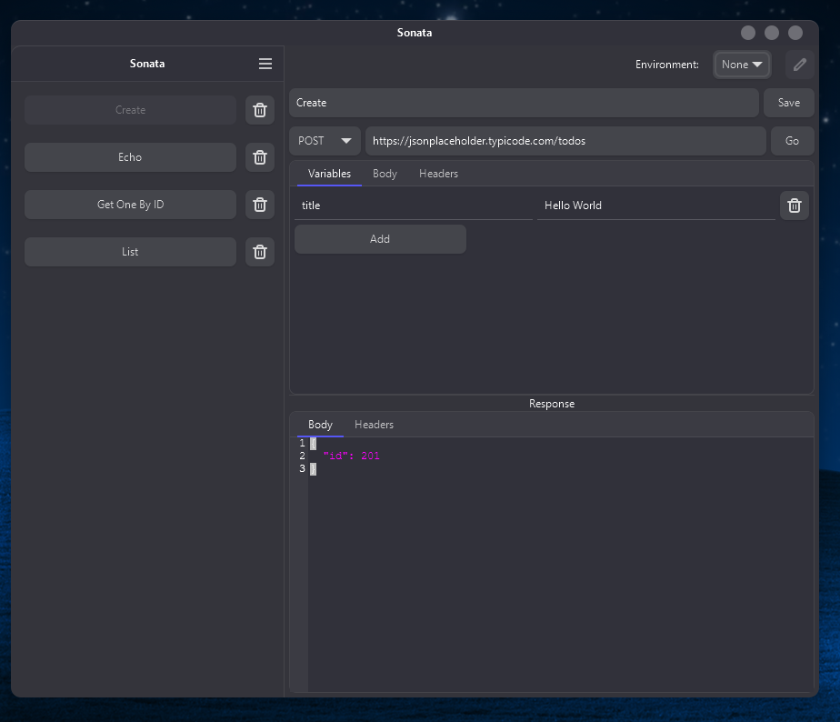

# SONATA

Yet another Rest API Client, but with a simple CLI and a GTK interface.

_don't take it too serious, it's just a hobby project._



## Usage - CLI

### Create a Project

Run:

`sonata new project <name>`

### Create a Request

Run (_interactive mode_):

`sonata new request`

To add variables, use the syntax of Go templates, such as:

`http://localhost:1234/users/{{ .id }}`

You can use this syntax for the URL, Headers and Body.

_see the Template Functions section too_

### Run a Request

Run:

`sonata run <name>`

To set a variable, pass the flag `-v name=value`.

To load a .env, pass the flag `-e <name.env>`


## Template Functions

Some of the functions that you can use for the request template, are:

- `randomUUID`: for a random uuid
- `queryEscape`: for escaping query params
- `pathEscape`: for escaping path params
- `env`: for loading a env var

You can use them like so:

```
{
    "id": "{{ randomUUID }}",
    "password": "{{ env "PASSWORD" }}",
}
```

## License

This project is licensed under the [MIT license](./LICENSE).

Permission is hereby granted, free of charge, to any person obtaining a copy
of this software and associated documentation files (the "Software"), to deal
in the Software without restriction, including without limitation the rights
to use, copy, modify, merge, publish, distribute, sublicense, and/or sell
copies of the Software, and to permit persons to whom the Software is
furnished to do so, subject to the following conditions:
